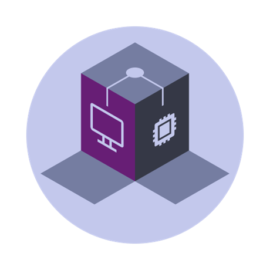
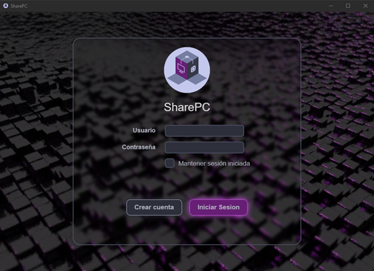
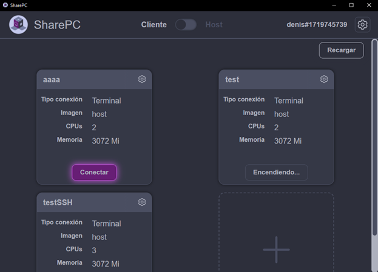
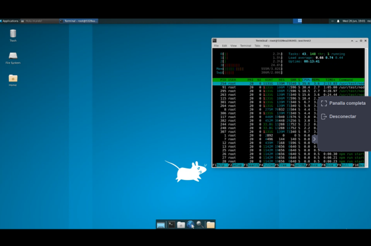
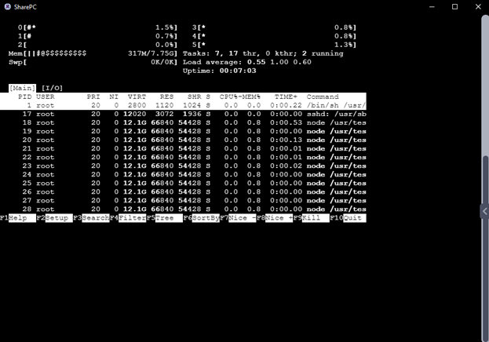

# sharepPC

Share PC is a place where people with high resources PCs (Hosts) can offer their computational power to the rest of the world, and allow people with more low spec computers (Clients) to use this shared computational power by creating a remote enviroment on the Hosts PC.

This repo contains all the code base used in my Master's degree final project for the Telecommunications Engineering Master's Degree at Universidad de Sevilla. It contains the code for both Clients side and the Server side.

Link to the document: https://idus.us.es/items/2efc50dd-9c06-412f-a30f-12cd3f2fd29f

  
## Abstract 
Technology has become a central aspect of our lives, and proof of that is the immense amount of software we
use on a daily basis. Over the years, however, this software has become increasingly complex, requiring more
and more power and hardware resources to run, to the point that we need supercomputers for certain programs.
While almost everyone has a computer capable of performing basic tasks, not everyone has a powerful enough
computer to handle demanding tasks, like video rendering or neural network training. Is there any way of running
these tasks without needing to buy a new computer?
This document proposes a solution to this problem through the development of an application that allows its
users to offer their resources to the rest of the world, so that everyone can use them remotely and securely. This
is achieved by developing a desktop app and setting up a server that utilizes various virtualization technologies

  
## Some captures

### Login

### Client Side
###### Client interface

###### RDP Connection

###### SSH Connection

### Host Side
