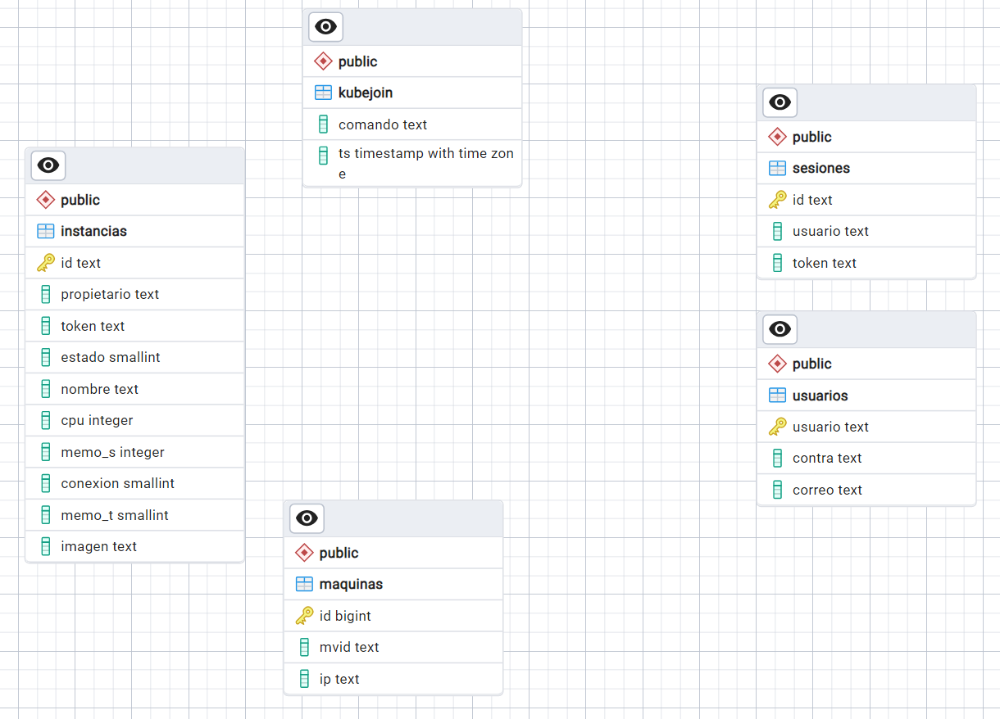

# Server Configuration

There are a few steps to follow if you want to recreate this scenario.

## Kubernetes master

- Run the <em>master.sh</em> command
- Delete the pods related to flannel with the following command:
<code>$ sudo kubectl dekete po -n kube-flannel \<Pod-name></code>

- Modify the flannel DaemonSet so you set your public master's IP
<code>$ sudo kubectl edit ds kube-flannel-ds -n kube-system</code>
```
spec:
  template:
    spec:
      containers:
      - name: kube-flannel
        env:
        - name: KUBERNETES_SERVICE_HOST
          value: "<Master's node IP>"
        - name: KUBERNETES_SERVICE_PORT
          value: "<Master's node Port>"
```
- Again delete all flannel related pods
- Add a secret registry for your private images repository
<code>$ kubectl create secret docker-registry regcred --docker-server=https://index.docker.io/v1/ --docker-username=<your-name> --docker-password=<your-pword> --docker-email=<your-email></code>

## Rest API
- Inside the API folder build the image and run it with the following commands:
<code>$ docker built -t \<image-name> .</code>

<code>$ docker run -it -d -p \<API Listening Port>:80 -e HOST_API = <> -e PORT_API=<> -e HOST_WS=<> -e PORT_WS=<> -e HOST_TURN=<> -e PORT_TURN=<> -e USER_TURN=<> -e PASS_TURN=<> --dns 8.8.8.8 --dns 8.8.4.4 --name share_api \<image-name></code>

## Signaling Server
- Build and run the image inside the service folder with the following commands:

<code>$ docker built -t \<iamge-name> .</code>

<code>$ docker run -it -d -p \<PORT_WS>:\<PORT_WS_PRIV>-e HOST_API=<> -e PORT_API=<> -e PATH_API=<> -e PORT_WS=<> --dns 8.8.8.8 --dns 8.8.4.4 --name signaling signaling</code>

## Coturn Server
- Set up the config file <em>turnserver.conf</em>, setting up the <em>expternal-ip</em> and <em>listening-ip</em>.
Run the image with the following command.
<code>\$ docker run -d --network=host -v $(pwd)/turnserver.confg:/etc/coturn/turnserver.conf --name coturn coturn/coturn</code>

## PSQL Database
- You have to propperly set up your PSQL data base with the following tables and columns.


- The user, password and other configuration should be reflected in the <em>database.py</em> file inside the API so it can access it.

## Remote Images
It is needed to upload the images that will be used as remote enviroments. The images can have the name you want, but you have to specify in the python Rest API the user and image. To do so, modify the file 